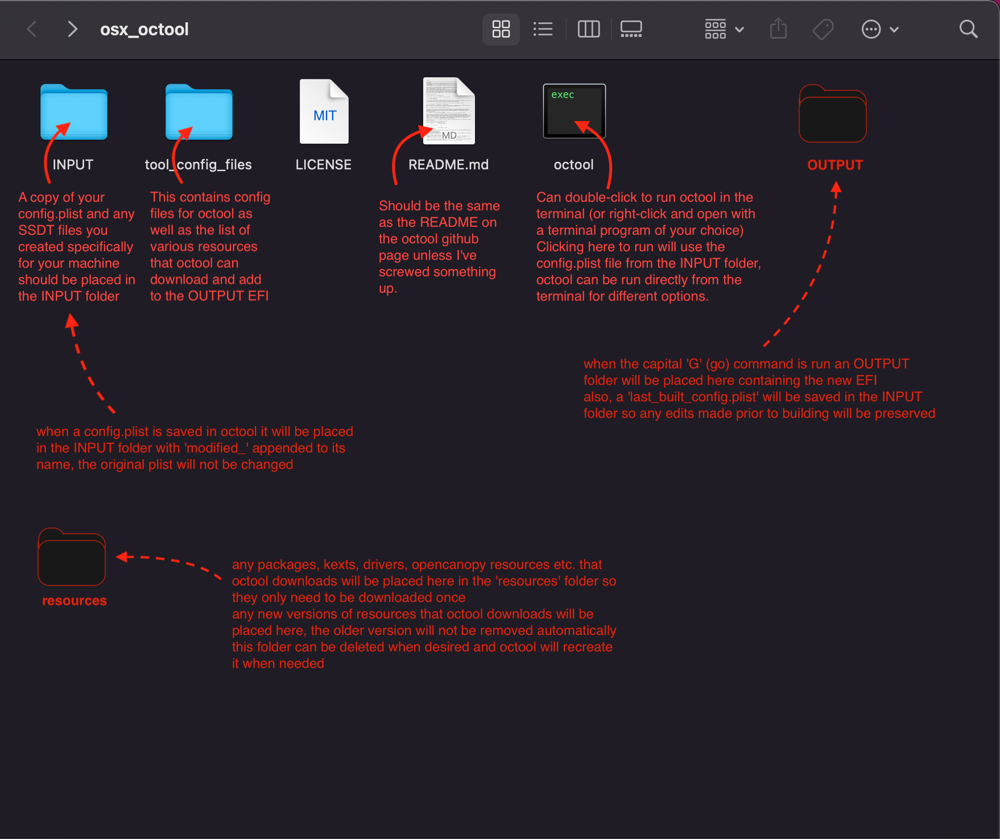

Simple picture guide showing common usage of octool

***
## when downloaded the octool folder will contain these items
***

***
## on first run you will see something similar to this
***
[[images/02_first_run.png]]

***
## summary of basic navigation and commands
***
[[images/03_navigation.png]]

***
## how different data types are represented in the octool editor
***
[[images/04_types.png]]

***
## editing a data type by hex or string
***
[[images/05_edit_data.png]]

***
## editing an integer type
***
[[images/06_edit_integer.png]]

***
## editing a string type
***
[[images/07_edit_string.png]]

***
## the cut copy and paste commands
***
[[images/08_cut_copy_paste.png]]

***
## displaying Configuration.pdf information for a field
***
[[images/09_field_info.png]]

***
## typical display of resources in the config.plist
***
[[images/10_resources.png]]

***
## information for the selected resource
***
[[images/11_resource_info.png]]

***
## changing version of OpenCore being used
***
[[images/12_oc_version.png]]

***
## changing version of single resource
***
[[images/13_res_version.png]]

***
## typical save output showing errors in config.plist
***
[[images/14_save.png]]

***
## the merge and purge commands for updating the config.plist
***
[[images/15_merge_purge.png]]

***
## the ordering command for checking kext requirements and order
***
[[images/16_ordering.png]]

***
## adding a kext to the Kernel>Add section
***
[[images/17_adding_kext.png]]
